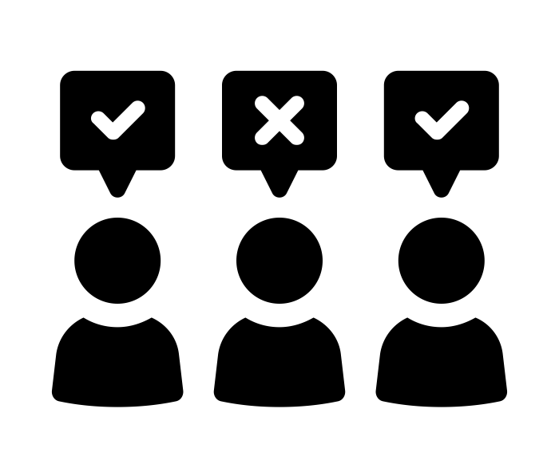
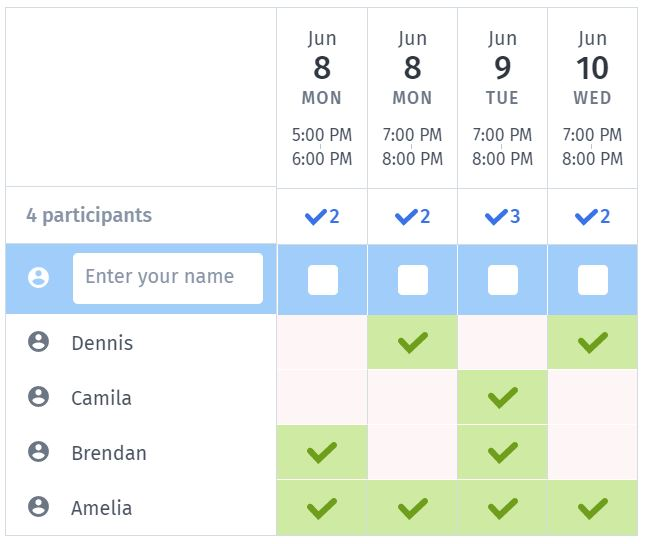

# Debiasing Doodle Polls

This repository details a suggested approach to circumvent social bias on open Doodle polls.

A full walkthrough can be found [here](https://tom-beer.github.io/post/debiasing-doodle-polls/).

  

logo created by [Adrien Coquet](https://thenounproject.com/search/?q=poll&i=2714889) from the Noun Project
